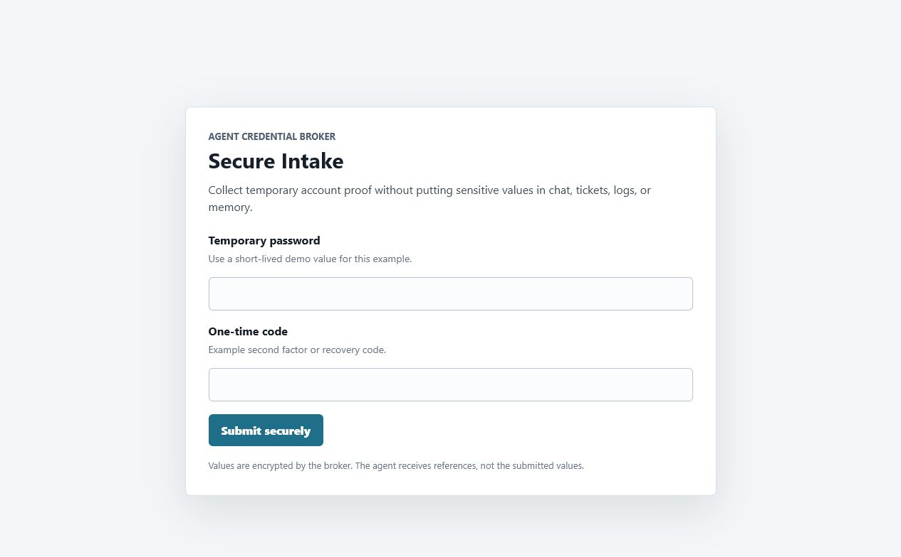
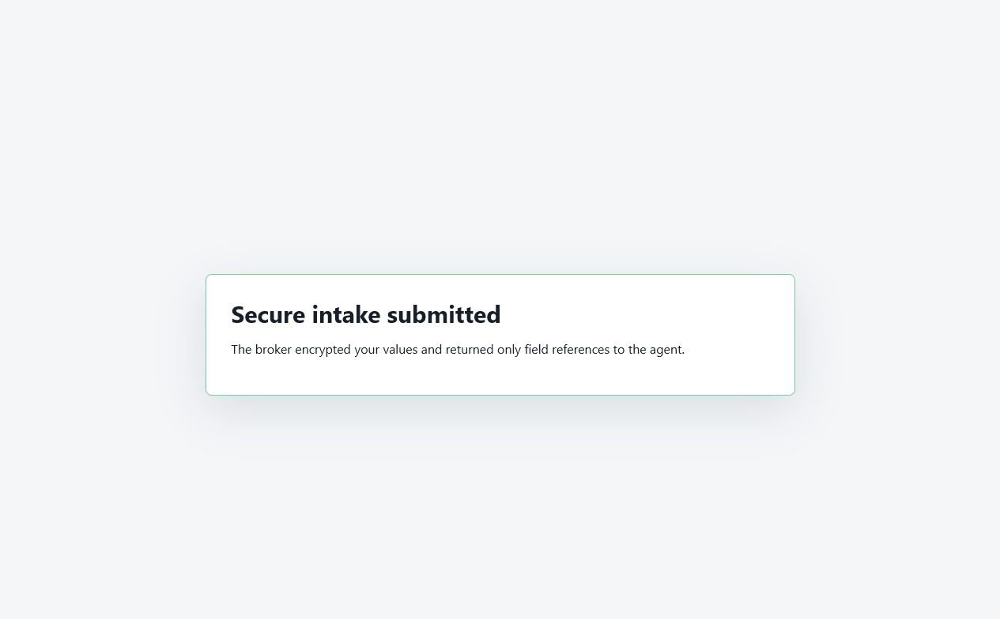

# Agent Credential Broker

A small, local, secretless credential broker proof of concept for AI agents.

Agents should not read vaults and should not receive raw passwords, API keys, SSH keys, or long-lived tokens. Instead, agents request scoped leases and call broker-owned provider adapters. The broker resolves secrets inside its own process, injects them into the provider call, records audit evidence, and returns provider results with no secret values.

The broker also includes a generalized sensitive-intake form pattern for values
that users would otherwise paste into chats, tickets, email, prompts, logs, or
memory. Agents create a short-lived form with exact fields, users submit values
to the broker, and agents receive only references.

This repo is a minimal pattern, not a full enterprise vault.

## Concept

1. An operator stores a credential in the broker vault.
2. An operator grants an agent a scoped lease: `agent_id + system + resource_type + resource_id + action + ttl`.
3. The agent requests a lease token for one exact use boundary.
4. The agent calls a provider adapter with that lease token.
5. The broker verifies scope, resolves the encrypted secret, performs the provider action, audits the action, and returns safe output.

The agent can use the credential-backed capability without seeing the credential.

## Contents

- `src/broker.py` - stdlib HTTP server, raw `psycopg2`, Fernet encryption, scoped leases, demo provider adapter.
- `schema/001_init.sql` - raw PostgreSQL schema.
- `tests/test_security.py` - unit tests for token expiry, scope matching, redaction, and secretless responses.
- `docs/security-review.md` - review of the Agentic Operations lease approach and comparable patterns in the wild.
- `docs/sensitive-intake.md` - generalized secure form example for user-provided sensitive values.
- `docs/assets/secure-intake-*.png` - screenshots used by the docs.
- `.codex/skills/agent-credential-broker/SKILL.md` - installable skill for agents.

## Quick Start

```bash
python -m venv .venv
. .venv/bin/activate
pip install -r requirements.txt
python src/broker.py generate-key
```

Copy `.env.example` to `.env`, paste the generated `BROKER_MASTER_KEY`, and set generated database/service-token values.

Start PostgreSQL:

```bash
docker compose up -d postgres
python src/broker.py init
python src/broker.py serve
```

## Demo Flow

Store a fake demo provider token:

```bash
DEMO_PROVIDER_TOKEN=$(python -c "import secrets; print(secrets.token_urlsafe(32))")

curl -sS -X POST http://127.0.0.1:8766/admin/secret \
  -H "Content-Type: application/json" \
  -H "X-Broker-Service-Token: $BROKER_SERVICE_TOKEN" \
  -d "{\"system\":\"demo\",\"resource_type\":\"dataset\",\"resource_id\":\"alpha\",\"action\":\"read\",\"secret_value\":\"$DEMO_PROVIDER_TOKEN\"}"
```

Grant an agent:

```bash
curl -sS -X POST http://127.0.0.1:8766/admin/grant \
  -H "Content-Type: application/json" \
  -H "X-Broker-Service-Token: $BROKER_SERVICE_TOKEN" \
  -d '{"agent_id":"agent-1","system":"demo","resource_type":"dataset","resource_id":"alpha","action":"read","ttl_seconds":600}'
```

Request a lease token:

```bash
LEASE_TOKEN=$(curl -sS -X POST http://127.0.0.1:8766/leases/request \
  -H "Content-Type: application/json" \
  -d '{"agent_id":"agent-1","system":"demo","resource_type":"dataset","resource_id":"alpha","action":"read"}' | python -c "import sys,json; print(json.load(sys.stdin)['lease_token'])")
```

Use the provider through the broker:

```bash
curl -sS -X POST http://127.0.0.1:8766/provider/demo/read \
  -H "Content-Type: application/json" \
  -d "{\"lease_token\":\"$LEASE_TOKEN\",\"query\":\"show status\"}"
```

The response proves the broker injected the credential, but it never returns the secret.

## Sensitive Intake Forms

Scoped leases prevent agents from reading stored credentials. Sensitive intake
prevents a different leak path: the user pastes protected values into the agent
conversation because the agent naturally asked for them.

With sensitive intake, the agent creates one generalized form request, shares the
broker-hosted `form_url`, and later polls for status. The submitted values are
encrypted and stored behind the broker. The agent sees only field labels and
`value_ref` references. Provider adapters can resolve those values inside the
broker process after a scoped lease allows that exact action.





Create a dynamic secure form:

```bash
curl -sS -X POST http://127.0.0.1:8766/intake/request \
  -H "Content-Type: application/json" \
  -d '{
    "agent_id": "agent-1",
    "purpose": "Collect temporary account proof without putting sensitive values in chat, tickets, logs, or memory.",
    "ttl_seconds": 600,
    "fields": [
      {"key":"temporary_password","label":"Temporary password","type":"password","required":true},
      {"key":"otp_code","label":"One-time code","type":"text","required":true}
    ]
  }'
```

After the user submits the form, the agent checks status:

```bash
curl -sS -X POST http://127.0.0.1:8766/intake/status \
  -H "Content-Type: application/json" \
  -d '{"agent_id":"agent-1","request_ref":"intake_example"}'
```

The response returns references, not raw values:

```json
{
  "request_ref": "intake_example",
  "status": "submitted",
  "fields": [
    {
      "key": "temporary_password",
      "label": "Temporary password",
      "value_ref": "intake_example:temporary_password",
      "submitted": true
    }
  ],
  "secret_values_returned": false
}
```

See `docs/sensitive-intake.md` for the full flow, provider-use example, and
production notes.

## Security Notes

- Bind to localhost by default.
- Put TLS/auth proxy in front before exposing to a network.
- Use strong generated `BROKER_MASTER_KEY`, `BROKER_SERVICE_TOKEN`, and database password.
- Back up the encrypted database and the master key separately. Without the master key, encrypted secrets are unrecoverable. With both together, the vault is compromised.
- Keep provider adapters narrow. Do not add a generic "run arbitrary command with secret env" endpoint.
- Log decisions and provider actions, but never raw secret values.
- Treat sensitive intake form URLs as short-lived bearer submission links. Use one-use forms and authenticated routing in production.

## Tests

```bash
python -m unittest discover -s tests
python -m py_compile src/broker.py
```
